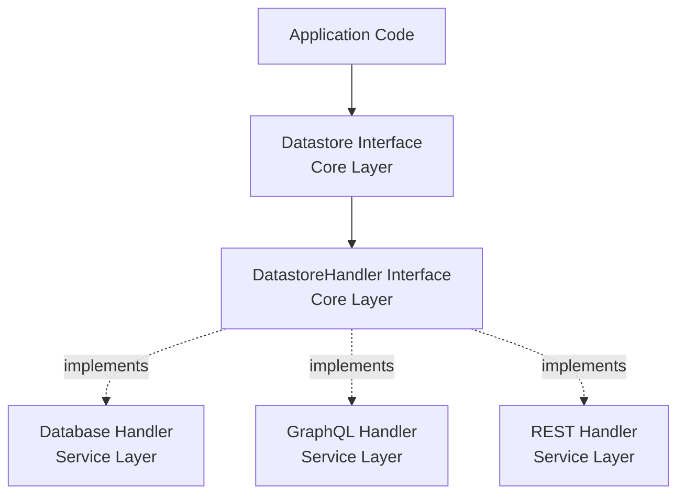
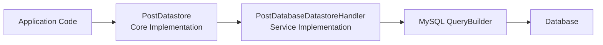

# Overview and Architecture

## What is the datastore pattern?

The datastore pattern is a two-level abstraction system for data persistence that keeps your code independent of specific storage implementations. Instead of writing database queries directly in your business logic, you define how data operations should work through interfaces, then provide concrete implementations that talk to actual data sources.

This pattern ensures your domain code remains portable. Whether data comes from a local database, a REST API, GraphQL endpoint, or in-memory cache, your application logic stays the same. You can swap implementations without rewriting the code that uses them.

The pattern consists of two primary layers: **Core** for business interfaces and domain logic, and **Service** for concrete storage implementations. This separation is the foundation of implementation-agnostic design.

---

## Why this separation matters

Separation of concerns keeps your codebase flexible and maintainable. When data access is tightly coupled to a specific storage mechanism, changing that mechanism requires touching every piece of code that reads or writes data. This creates risk, increases testing burden, and makes your code harder to move between environments.

The datastore pattern solves this by treating storage as a swappable dependency. Your business logic depends only on interfaces that describe what operations are possible. The actual implementation—whether it queries MySQL, calls a REST API, or reads from Redis—is provided at runtime through dependency injection.

This approach provides several concrete benefits:

- **Portability**: Move between storage systems without refactoring domain code
- **Testability**: Swap real implementations for test doubles during testing
- **Flexibility**: Support multiple data sources simultaneously for different entities
- **Future-proofing**: Adapt to changing requirements without rewriting core logic

Consider a scenario where your application initially stores collaborator data in a local database. Later, you need to fetch collaborators from a remote API to integrate with a partner system. With the datastore pattern, you implement a new handler that calls the API instead of the database. Your domain code—the code that creates, updates, and queries collaborators—requires no changes.

---

## The two-level architecture

The pattern uses two distinct layers, each with a specific responsibility.

### Core layer: Business interfaces

The Core layer defines **what** operations are possible, without specifying **how** they work. It contains:

- **Interfaces** that declare data operations (create, find, update, delete, query)
- **Models** that represent domain entities as value objects
- **Datastore implementations** that delegate to handler interfaces using the decorator pattern

Core never depends on Service. It knows nothing about databases, HTTP clients, or any concrete storage technology. This ignorance is intentional and ensures portability.

Example Core interface:

```php
interface PostDatastore {
    public function create(array $attributes): Post;
    public function find(int $id): Post;
    public function update(int $id, array $attributes): void;
    public function delete(int $id): void;
    public function where(array $conditions): array;
}
```

### Service layer: Concrete implementations

The Service layer provides **how** operations are executed. It contains:

- **Handler implementations** that interact with actual data sources
- **Table definitions** (for database implementations) that define schema
- **Adapters** that convert between models and storage formats

Service depends on Core interfaces and implements them. Multiple Service implementations can exist for the same Core interface, enabling you to choose implementations based on environment, performance needs, or integration requirements.

Example Service implementations:

```php
// Database implementation
class PostDatabaseDatastoreHandler implements PostDatastoreHandler {
    public function find(int $id): Post {
        // Query database, convert row to Post model
    }
}

// GraphQL implementation
class PostGraphQLDatastoreHandler implements PostDatastoreHandler {
    public function find(int $id): Post {
        // Query GraphQL endpoint, convert response to Post model
    }
}
```

---

## Communication flow

Understanding how data flows through the layers helps clarify the architecture. The pattern uses two types of flow: conceptual (design-time) and runtime (execution).

### Conceptual flow: Layers and abstractions

At design time, the architecture looks like this:



The Core layer defines interfaces. The Service layer provides implementations. Application code depends only on Core interfaces, never on Service implementations directly.

### Runtime flow: Concrete execution

At runtime, when your application executes a data operation, the flow looks like this:



1. Application code calls a method on the Datastore
2. Datastore delegates to its injected Handler
3. Handler (database implementation) builds a query
4. Query executes against the database
5. Result is converted to a Model and returned

Swap the handler for a GraphQL implementation, and steps 3-4 change to API calls instead of SQL queries. The application code and Datastore remain identical.

---

## Key abstractions

Several abstractions work together to enable the pattern.

### Datastore

The **Datastore** is the primary interface your application code interacts with. It defines business-level operations and may include domain-specific query methods beyond basic CRUD.

```php
interface PostDatastore extends Datastore, DatastoreHasPrimaryKey, DatastoreHasWhere {
    public function getPublishedPosts(): array;
    public function getByAuthor(int $authorId): array;
}
```

The Datastore implementation uses decorator traits to delegate standard operations to a handler, while implementing custom business methods directly.

### DatastoreHandler

The **DatastoreHandler** is the low-level interface that concrete implementations fulfill. It extends the same base interfaces as the Datastore but typically includes only standard operations, not business-specific methods.

```php
interface PostDatastoreHandler extends Datastore, DatastoreHasPrimaryKey, DatastoreHasWhere {
    // Only standard interface methods, no custom business logic
}
```

Handlers are the swap points. When you want to change storage mechanisms, you implement a new handler without touching the Datastore interface or its consumers.

### Model

The **Model** represents a domain entity as an immutable value object. Models know nothing about persistence—they have no save methods, no database awareness. They are pure data with behavior.

```php
class Post implements DataModel, HasSingleIntIdentity {
    public function __construct(
        private int $id,
        private string $title,
        private string $content,
        private DateTime $publishedDate
    ) {}

    public function getId(): int { return $this->id; }
    public function getTitle(): string { return $this->title; }
}
```

### ModelAdapter

The **ModelAdapter** converts between Models and storage representations (typically arrays). Handlers use adapters to transform raw data into Models on read, and Models into storable formats on write.

```php
class PostAdapter implements ModelAdapter {
    public function toModel(array $data): Post {
        return new Post(
            $data['id'],
            $data['title'],
            $data['content'],
            new DateTime($data['published_date'])
        );
    }

    public function toArray(Post $model): array {
        return [
            'id' => $model->getId(),
            'title' => $model->getTitle(),
            'content' => $model->getContent(),
            'published_date' => $model->getPublishedDate()->format('Y-m-d H:i:s')
        ];
    }
}
```

---

## Example: Swapping implementations

The core value of this architecture is implementation independence. Here is how it works in practice.

### Starting with a database

Initially, your blog stores posts in a MySQL database:

```php
class PostDatabaseDatastoreHandler implements PostDatastoreHandler {
    public function find(int $id): Post {
        $row = $this->queryBuilder
            ->select()
            ->from($this->table)
            ->where('id', '=', $id)
            ->execute()
            ->fetch();

        return $this->adapter->toModel($row);
    }
}
```

Your application code uses the Datastore:

```php
$post = $postDatastore->find(123);
echo $post->getTitle();
```

### Switching to GraphQL

Your requirements change. Posts now come from a remote GraphQL API. You implement a new handler:

```php
class PostGraphQLDatastoreHandler implements PostDatastoreHandler {
    public function find(int $id): Post {
        $query = "query { post(id: $id) { id title content publishedDate } }";
        $response = $this->graphqlClient->execute($query);

        return $this->adapter->toModel($response['data']['post']);
    }
}
```

You update your dependency injection configuration to bind `PostDatastoreHandler` to the GraphQL implementation instead of the database implementation. Your application code remains unchanged:

```php
$post = $postDatastore->find(123);  // Now fetches from GraphQL
echo $post->getTitle();
```

No business logic was modified. No tests for application code need updates. Only the handler implementation and its tests changed.

---

## When to use this pattern

PHPNomad is designed around the datastore pattern. If you are building applications with PHPNomad, especially when working with databases, this pattern is the expected approach.

The pattern is required when:

- You are using PHPNomad's database layer for local data storage
- You need to integrate data from multiple sources with a unified interface
- Your application design follows nomadic principles of portability and swappability

The architecture is most beneficial when:

- You anticipate changing storage implementations in the future
- Testing domain logic independently of storage is important
- Multiple environments require different storage strategies

PHPNomad's database abstractions and table schema system are built to work with this pattern. Using the datastore pattern with PHPNomad ensures your code remains portable and consistent with the framework's design philosophy.

---

## Related topics

- **[Getting Started: Your First Datastore](getting-started-tutorial)** — Build a complete datastore implementation from scratch
- **[Core Datastore Layer](../packages/datastore/core-implementation)** — Deep dive into Core interfaces and implementations
- **[Database Service Layer](../packages/database/database-handlers)** — Detailed guide to database-backed handlers
- **[Models and Identity](models-and-identity)** — How to design models and identity systems
- **[Dependency Injection and Initialization](dependency-injection)** — Register and bootstrap datastores

---

## Summary

The datastore pattern provides implementation-agnostic data access through a two-level architecture. The Core layer defines business interfaces and domain models. The Service layer provides concrete storage implementations. This separation enables you to swap data sources without refactoring application logic, keeping your code portable, testable, and adaptable to changing requirements.
